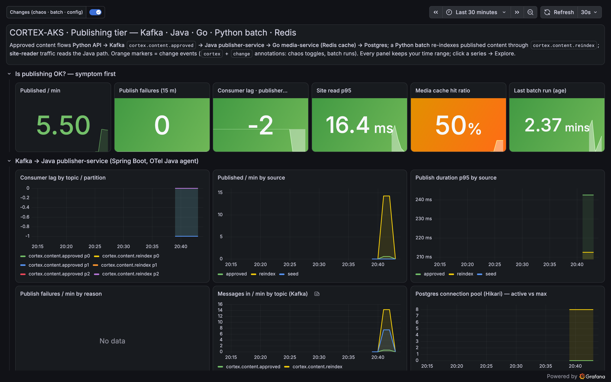

# grafana-assistant-demo

An **open-source AI assistant for Grafana Cloud**, and a polyglot pipeline for it to debug.

The assistant is two Apache-2.0 projects wired together: [goose](https://github.com/block/goose) (Block's agent) talking to
Grafana Cloud through [mcp-grafana](https://github.com/grafana/mcp-grafana) (Grafana Labs' MCP server). The pipeline is a
content-publishing tier in four languages (Python, Java, Go, Python batch) with Kafka, a Redis cache tier and Postgres,
instrumented with OpenTelemetry and shipped to Grafana Cloud by Alloy. Chaos toggles break it in three realistic ways;
scripted demos show the assistant finding each root cause and, in one case, writing the fix back into Grafana.

The six-part article series that goes with this repo lives in
[sathpal/grafana-articles](https://github.com/sathpal/grafana-articles).

```text
  you ──prompt──▶ goose ──MCP tools──▶ mcp-grafana ──Grafana API──▶ Grafana Cloud (Mimir · Loki · Tempo · Alerting)
                                                                            ▲
  approvals-api (Python) ─▶ Kafka ─▶ publisher-service (Java) ─▶ media-service (Go) ─▶ cache-redis        │ OTLP + scrapes + logs
                    content-batch (Python) ─▶ Kafka           ─▶ Postgres        site-reader (Python) ─▶ Alloy ─┘
```

## Quick start

```bash
git clone https://github.com/sathpal/grafana-assistant-demo && cd grafana-assistant-demo
cp .env.example .env            # Grafana Cloud OTLP credentials + GRAFANA_URL + a service-account token
make check
make up && make seed            # ~5 min the first time (Maven + Go + pip builds), then 300 articles published
make grafana                    # dashboard "Publishing tier" + 5 alert rules in folder CORTEX-AKS

go install github.com/grafana/mcp-grafana/cmd/mcp-grafana@latest
make mcp &                      # the Grafana MCP server on localhost:8300 (8000 belongs to the approvals API)

make demo P=1                   # the pieces and one approval end to end (see demos/README.md for all six)
```

Without a model key the demos still show every piece of evidence the assistant would gather (through the same MCP calls);
with `goose` and a provider key (`ANTHROPIC_API_KEY`, `OPENAI_API_KEY`, or Ollama) they run the recipes too.

## Sub-projects

| folder | what | language |
|---|---|---|
| [`services/approvals-api`](services/approvals-api) | the human gate: approve an article, produce to Kafka with trace context in the headers | Python, FastAPI, aiokafka |
| [`services/publisher-service`](services/publisher-service) | consumes both content topics, renders, calls media-service, writes Postgres, caches in Redis, serves `GET /published/{id}`; chaos: `slow-render`, `db-write-fail`, `heap-pressure`, `consumer-pause` | Java 21, Spring Boot 3.4, OTel Java agent |
| [`services/media-service`](services/media-service) | renders OG images, caches 20 KiB blobs per channel variant in `cache-redis`, announces on Kafka; chaos: `media-slow-render`, `cache-stampede`, `no-ttl`, `goroutine-leak` | Go 1.23, OTel Go SDK |
| [`services/content-batch`](services/content-batch) | the reindex batch (`batch.py`), synthetic readers (`reader.py`), the seeder (`seed.py`); chaos: `batch-flood`, `batch-flood-media` | Python |
| [`assistant/`](assistant) | goose recipes with the house rules, `mcp_call.py` (call any MCP tool), `evidence.py` (the queries an on-call assistant runs, printed) | Python, YAML |
| [`demos/`](demos) | one narrated, scripted demo per article part (`make demo P=1..6`) | bash |
| [`grafana/`](grafana) | dashboards-as-code (`push_grafana.py`), the alert rules, the runbook | Python, JSON |
| [`infra/alloy`](infra/alloy) | the Alloy pipeline: OTLP in, exporter scrapes, container logs, Grafana Cloud out | Alloy |
| [`scripts/chaos.sh`](scripts/chaos.sh) | toggles a scenario and writes a `cortex` + `change` annotation to Grafana | bash |

## The three incidents

| `make chaos S=` | what breaks | article |
|---|---|---|
| `batch-flood` | 3,000 reindex messages every 5 min; approved articles queue behind them (peak lag ~5,000, ~66 s per approval) | Part 3 |
| `no-ttl`, then `batch-flood-media` | images cached without expiry, then 6,000 forced renders fill the 48 MiB cache tier: evictions, 0 % hit ratio, lag | Part 4 |
| `db-write-fail` | Postgres rejects every write but the consumer commits its offset: lag 0, green dashboards, 404s | Part 5 |

`make chaos S=reset` clears everything. Every toggle and every batch run writes a Grafana annotation, which is what the
assistant reads first.

## Use cases: where the assistant saves time, and why open source

| # | Case | Human baseline | Assistant | Why it is efficient |
|---|---|---|---|---|
| 1 | Cross-signal root cause (Part 3) | 6 PromQL queries, a LogQL search, copy a trace id, read 28 spans: 20 to 30 min for someone fluent in all three | 9 tool calls, one report with every query quoted, under 2 min | No PromQL, LogQL or TraceQL needed on call; the log-to-trace pivot is automatic |
| 2 | "What changed, in what order?" (Part 4) | Scrub five dashboards, note timestamps by eye, open alert history separately | Range queries at 15 s steps, first-breach times, alert history read from Loki, one timeline table | Ordering events is mechanical and error-prone for humans, trivial for a tool loop |
| 3 | Silent failure (Part 5) | Nobody looks, because nothing is red; found hours later by an editor | Consumed-minus-published arithmetic across two counters, one log line per article, one red span | Finds a class of bug no lag or latency alert can see |
| 4 | Write back the guard rails (Part 5) | Three UI workflows: annotation, alert rule with threshold and summary, dashboard JSON edit | Three tool calls, attributable to the service account, in the same session | The investigation leaves a better Grafana behind, not a transcript |
| 5 | "Why did nobody get paged?" (`recipes/paged.yaml`, `evidence.py paged`) | Open each rule: state, threshold, pause flag, history | Lists paused rules and thresholds tuned for floods that miss six lost articles | One-prompt audit of things that are found only after the incident |
| 6 | Incident update for humans | Written by hand from memory | "Write a Slack-ready update with deep links" from evidence it already holds | Free once the investigation is done; every claim is clickable |
| 7 | Dashboard and metric hygiene (`recipes/hygiene.yaml`, `evidence.py hygiene`) | Notice a NaN p95 weeks later | Checks every panel query against Mimir, flags histograms without buckets and windows shorter than 4x the scrape interval | A scheduled recipe instead of a person; this repo lost an hour to exactly this |
| 8 | Capacity sanity check | A spreadsheet, eventually | 300 articles x 10 variants x 20 KiB = 60 MiB into a 48 MiB tier, in the Part 4 verdict | The model is good at "does this fit", given the numbers |
| 9 | Scheduled health report | Not done, or done badly | `goose run --recipe` from cron or CI | Recipes are files in git: no seat licence, no UI |
| 10 | Regulated or air-gapped estates | Cloud assistants are not allowed | Same recipes with Ollama and a local model; prompts and telemetry never leave the network | Only possible because both halves are open source |

Why open source, in efficiency terms: it runs where the work is (terminal, CI, cron); cost is a dial (a frontier model
for the 02:00 root cause, a small or local model for the daily report); every call is in the MCP server log; the same
server drives the managed Grafana Assistant too, so there is no lock-in in either direction; and a recipe in git is a
runbook that executes itself.

## Self-hosted Grafana OSS (no cloud at all)

The same assistant works against a self-hosted, fully open-source Grafana. The repo ships an optional
[`grafana/otel-lgtm`](https://github.com/grafana/docker-otel-lgtm) container (Grafana OSS + Prometheus + Loki + Tempo)
and a second Alloy config that fans the same telemetry out to it:

```bash
make oss-up          # Grafana OSS on http://localhost:3001 (admin/admin); Alloy now ships to Cloud AND local
make grafana-oss     # the same dashboard + alert rules, pushed to the local Grafana
make mcp-oss &       # a second mcp-grafana on :8310, authenticated with basic auth against the local Grafana
GRAFANA_TARGET=oss make demo P=1              # every demo and audit accepts GRAFANA_TARGET=oss
GRAFANA_TARGET=oss python3 assistant/evidence.py paged
make oss-down        # back to Cloud only
```

What changes: the datasource UIDs (`prometheus`, `loki`, `tempo` instead of `grafanacloud-*`) and the credential
(username/password instead of a service-account token). What does not: the metric names, the `service_name` labels,
the trace ids, the recipes, the house rules, or the tool calls. Alert state history on OSS Grafana is annotation-based
unless you configure a Loki backend, so the "when did it last fire" column of the `paged` audit is empty there.



## Bridging to the managed Grafana Assistant (optional)

mcp-grafana can also hand a question to Grafana Cloud's own Assistant plugin, through an `ask_assistant` tool. It is
hidden by default for two reasons that are worth knowing:

1. The `assistant` category is **not in the default `--enabled-tools` list**; you must pass the whole list plus `assistant`
   (`make mcp-assistant` does this, on port 8320).
2. It **registers only when write tools are enabled**, because the managed Assistant can itself write to the stack, and
   it can read Loki server-side, so any `--disable-write` or Loki label-enforcement policy on the MCP server does not
   apply to what it reports back. Treat it as a write tool.

It needs the Assistant plugin (`grafana-assistant-app`) enabled on a Grafana Cloud stack; self-hosted OSS Grafana does
not have it. The two assistants are then side by side on the same MCP server: the open-source agent calling
`query_prometheus` and friends, and `ask_assistant` delegating the whole question to Grafana's managed one. That makes
"same question, both assistants" a one-command comparison:

```bash
make mcp-assistant &
MCP_URL=http://localhost:8320/mcp MCP_TIMEOUT=900 python3 assistant/mcp_call.py ask_assistant \
  '{"prompt":"Which alert rules in folder CORTEX-AKS are paused, and what is the consumer lag of publisher-service by topic? Quote your queries."}'
```

## Route C: no separate MCP process, use the LLM app's embedded server (optional)

Grafana's open-source [LLM app](https://grafana.com/grafana/plugins/grafana-llm-app/) (installed by default on Cloud,
installable on self-hosted) embeds an MCP server inside Grafana itself, at
`/api/plugins/grafana-llm-app/resources/mcp/grafana` (streamable HTTP). goose can point straight at Grafana, with a
service-account token in the `Authorization` header, and no `mcp-grafana` process to run:

```bash
# any MCP client; here the repo's helper
MCP_URL=https://<stack>.grafana.net/api/plugins/grafana-llm-app/resources/mcp/grafana \
MCP_AUTH="Bearer $GRAFANA_SA_TOKEN" python3 assistant/mcp_call.py --tools
```

Tested on both targets. What to know before choosing it over Route A (`make mcp`):

| | standalone `mcp-grafana` v1.5.1 | LLM app 1.0.8 embedded server |
|---|---|---|
| tools | 81 | 69 on Cloud, 59 on self-hosted (older bundled build) |
| Tempo (`search_tempo_traces`, `get_tempo_trace`) | yes | **no**: Parts 3 and 5 need it |
| `user_info`, `ask_assistant` | yes (assistant opt-in) | no |
| Loki time arguments | relative (`now-15m`) or RFC3339 | RFC3339 only (older build); `now-15m` is rejected |
| `--disable-write`, `--disable-*`, server log as audit trail | yes | no per-tool policy; audit via Grafana's own logs |
| self-hosted auth | token or username/password | a **Bearer service-account token** (basic auth gets 401), and Grafana must run with `GF_FEATURE_TOGGLES_ENABLE=externalServiceAccounts` so the plugin gets its own managed service account (`sa-1-extsvc-grafana-llm-app`); the compose file sets this |
| runs where | anywhere (laptop, CI, cron) | wherever Grafana is |

The LLM app is also what gives self-hosted Grafana its in-UI AI features (explain a panel, query advisor) with your
own OpenAI, Azure OpenAI or Anthropic key (`provider:` in its provisioning); on Cloud it defaults to the
Grafana-managed model. That is a separate thing from the agent in this repo, and this repo does not need it configured.

## Ports and names

Containers are named `cortex-*` so the `service_name` labels match the dashboards, the alert rules and the articles.
Host ports: approvals-api 8000, publisher 8085, media 8086, batch 8087, Alloy UI 12345. Docker Desktop needs about 2 GiB
for the tier. The MCP server runs on 8300.

## Guard rails (Part 6, in one paragraph)

Run `mcp-grafana --disable-write` with a Viewer token by default; hand out an Editor token only for a session that is
meant to write; trim the tool list with `--disable-*`; run one server per team behind `--server-auth-token`; keep the
model pinned and the recipes in git; cap runs with `--max-tool-repetitions`. The server log is the audit trail.
